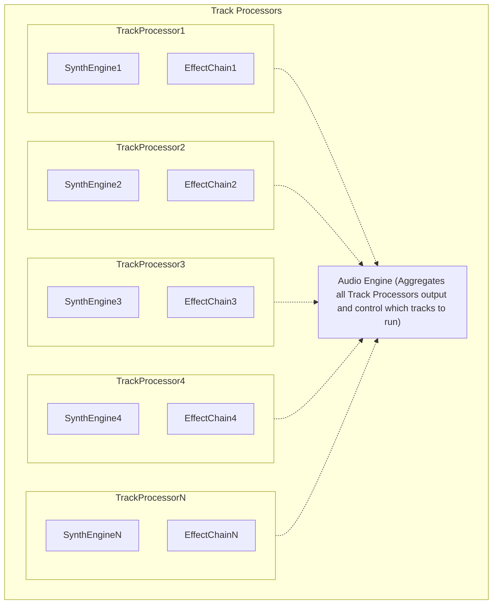
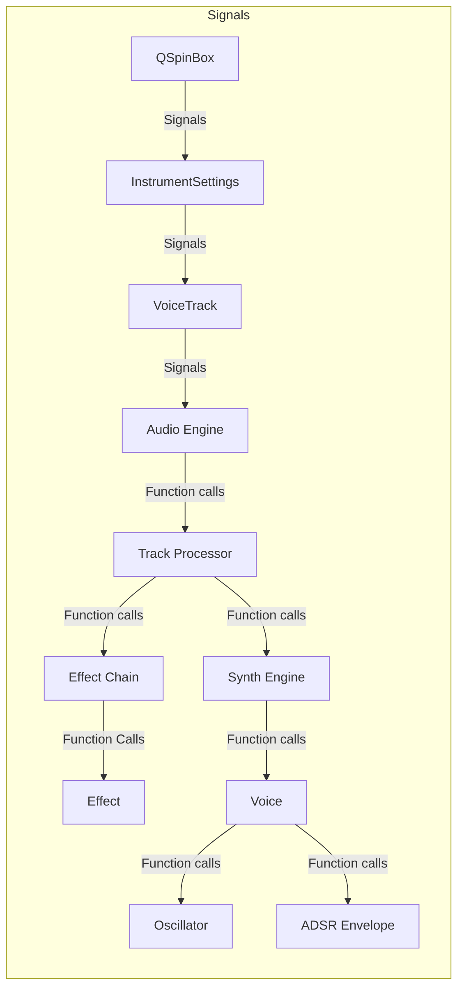
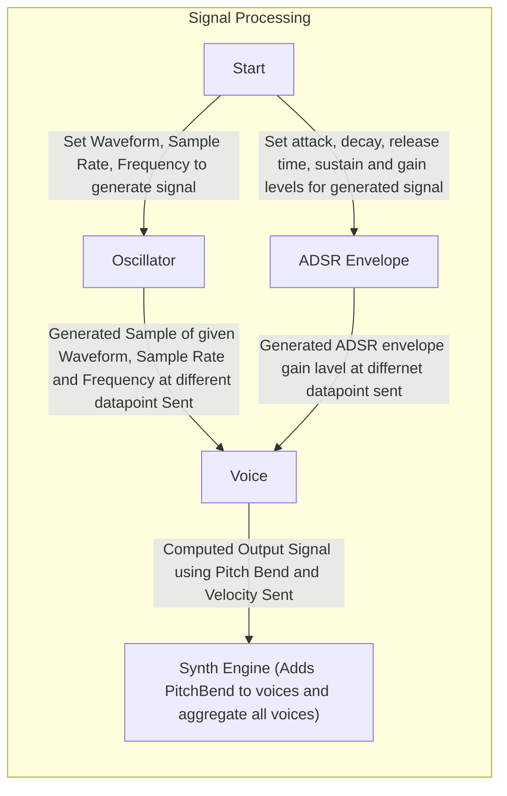

## Build using the command below

``` qt-cmake -S . -B build -G Ninja```

followed by installation with

```cmake --build build         ```
## Remove build files with
Remove-Item -Recurse -Force build


## If Above command Does not work try below
```cmake -S . -B build -G Ninja `
    -DCMAKE_C_COMPILER=path/to/mingw_64/bin/gcc.exe `
    -DCMAKE_CXX_COMPILER=path/to/mingw_64/bin/g++.exe```

## Install with 
```cmake --build build```


## About Cliche Station

Cliche Station is a midi compatible sound engine that uses the midi info inputed through a Midi Keyboard or other Midi devices and processes the digital signal to produce sound suitable for EDM and digital signal processing. It offers a wide range of processing capabilities on waveform like
changing velocity, Attack-Decay-Sustain-Release Envelope, compressing, clipping, reverb, pitchbending, distorting, flanging and modulating the signal. 

## How it works

Cliche Station uses RtMidi (a cross platform Open Source Midi Library) to input sound from a Midi compatible Keyboard device.

It has the following layout

```
root/
    ---audio/
        ---AudioEngine.cpp // contains the Synthesized sound with AudioEffects
        ---AudioEngine.h
        ---TrackProcessor.cpp // contains individual track specific settings
        ---TrackProcessor.h
        ---effects/
            ---AudioEffect.h // Base Class of all audio effects (clipping, delay, distortion, saturation)
            ---AudioEffectFactory.cpp // A Factory class fot creating several audio effects (now 12)
            ---AudioEffectFactory.h
            ---Chorus.cpp // Adds chorus effect
            ---Chorus.h
            ---Clipping.cpp // Produces clipping effect
            ---Clipping.h
            ---Compression.cpp // Add compression to sound
            ---Compression.h
            ---Delay.cpp // Adds dealy effect 
            ---Delay.h
            ---Distortion.cpp // Adds distortion to the sound
            ---Distortion.h
            ---EffectChain.cpp // Chains all effects in a order
            ---EffectChain.h
            ---EQ.cpp // EQ effects
            ---EQ.h
            ---Flanger.cpp // Adds flanging effects
            ---Flanger.h
            ---Gate.cpp // Adds gate effect
            ---Gate.h
            ---Limiter.cpp // Limits audio 
            ---Limiter.h
            ---Phaser.cpp // Adds Phaser effects
            ---Phaser.h
            ---Reverb.cpp // Adds Reverb 
            ---Reverb.h
            ---Saturation.cpp // Adds saturation
            ---Saturation.h
    ---gui/
        ---base.cpp // Main Window of the application
        ---base.h
        ---drumPad.cpp // Drum Pad layout
        ---drumPad.h
        ---effect_chain_editor.cpp // Allows Effect Reordering by Swapping
        ---effect_chain_editor.h 
        ---effect_slot.cpp // Contains reorderable slots
        ---effect_slot.h
        ---instrument_settings.cpp //InstrumentSettingscard
        ---instrument_settings.h
        ---main.cpp // entry point of the program. Contains QtStyles
        ---monitorWindow.cpp // window to connect to Midi Keyboard
        ---monitorWindow.h
        ---piano.cpp // piano layout incorporating piano roll and keyboard
        ---piano.h
        ---pianoKeyboard.cpp // Piano Keyboard Gui
        ---pianoKeyBoard.h
        ---pianoRoll.cpp // Synthesia or Piano Roll contains green Piano Tiles
        ---pianoRoll.h
        ---track_list.cpp // The bottom sheet containing voice tracks
        ---track_list.h
        ---voice_track.cpp // Voice Track card
        ---voice_track.h
        ---playlist/
            ---Clip.cpp // class defining the structure of a clip
            ---Clip.h
            ---ClipArea.cpp // class defining the Cliparea on the right pane of Playlist
            ---ClipArea.h
            ---ClipVisualizer.cpp // Visualiser for Clip
            ---ClipVisualizer.h
            ---Layer.cpp // Several layers form a Sequence
            ---Layer.h
            ---Playlist.cpp // Playlist is a collection of Sequence. (or a collection of song or music piece)
            ---Playlist.h
            ---Sequence.cpp // A collection of several layers whch we may call a song or single music piece
            ---Sequence.h
            ---TimelineView.cpp // Contains the timeline reference for the Clip
            ---TimelineView.h
            ---TimelineWidget.cpp // A widget that displays timeline
            ---TimelineWidget.h
            ---TimeRuler.cpp  // A ruler that tells time reference
            ---TimeRuler.h


    ---midi/
        ---MidiInput.cpp // Accepts midi input from Midi devices using RtMidi apis
        ---MidiInput.h
        ---RtMidi.cpp // RtMidi.cpp file taken from RtMidi github repository providing cross-platform supported midi apis
        ---RtMidi.h
    ---synth/
        ---ADSREnvelope.cpp // Manages ADSR Envelope
        ---ADSREnvelope.h
        ---Oscillator.cpp //capable of generating classical Sine, Saw, Triangle, Square and other waves
        ---Oscillator.h
        ---SynthEngine.cpp // renders wave profile as described in a Voice object
        ---SynthEngine.h
        ---Voice.cpp // object representing a voice as a function of keys pressed frequency, wave velocity, ADSR envelope, oscillator type(Sine, Triangle, Saw) and pitchbend set
        ---Voice.h
    ---wav/
        ---piano-sound-master/
            ---a1.wav
            ---a1s.wav
            ---b1.wav
            ---c1.wav
            ...
            ...
            ...
            ---g1s.wav
        //contains wavs file for several instruments  
```
```
A Single Voice Track is structured as follows:
VoiceTrack
    │
    ├── PianoRoll
    │
    ├── EffectChain
    │
    └── Synth / instrument settings
              │
              ↓
         SynthEngine
              │
       ┌──────┼──────┐
       ↓      ↓      ↓
     Voice  Voice  Voice
       │      │      │
       ├─ Oscillator
       └─ ADSREnvelope
```

### Content Structure

```
                    horizontal scroll position
                         ↓
                         SHARED TIMELINE
┌───────────────────────────────────────────────────────────────┐
│ Layer-column   │          SHARED TIME RULER                   │
|               0s        1s        2s        3s        4s      |
|                │         │         │         │         │      |
┌───────────────────────────────────────────────────────────────┐
│ ▼ Sequence 1                              [ + Add Layer ]     │
├────────────────┬──────────────────────────────────────────────┤
│ Voice Track 1  │ [ Clip A ]          [ Clip B ]               │
│            [M] │                                              │
├────────────────┼──────────────────────────────────────────────┤
│ Voice Track 2  │       [ Clip C ]                             │
│            [M] │                                              │
├────────────────┼──────────────────────────────────────────────┤
│ Voice Track 3  │                    [ Clip D ]                │
│            [M] │                                              │
├────────────────┴──────────────────────────────────────────────┤
│ ▼ Sequence 2                              [ + Add Layer ]     │
├────────────────┬──────────────────────────────────────────────┤
│ Voice Track 1  │ [ Clip ]                                     │
│            [M] │                                              │
├────────────────┼──────────────────────────────────────────────┤
│ Voice Track 2  │             [ Clip ]                         │
│            [M] │                                              │
└────────────────┴──────────────────────────────────────────────┘
      ↕ vertical scrolling
```

```
Proposed Plan for Playlist


Playlist // A QHBoxLayout  

│

├── TimeRuler  

 |           |-------a spacer of length = length of left Pane

 |           |--------actual ruler running to the right

│

└── TimelineView // a vertically  scrolling pane like QListView or QScrollBar with only Vertical Scroll enabled

    │

    ├── LeftPane // a fixed 160Hz Widget 

    │   └── LeftContent   // I think we dont even need this

    │       ├── Sequence 1 header // A fixed Size Widget

    │       ├── Layer 1// Fixed Widget

    │       ├── Layer 2// Fixed Widget

    │       ├── Layer 3// Fixed Widget

    │       ├── Sequence 2 header // Fixed Widget

    │       ├── Layer 1// Fixed Widget

    │       └── Layer 2// Fixed Widget

    │

    └── RightPane // A QScrollBar with only Horizontal SCroll possible

        └── RightContent // Again I dont think we need this

            ├── Sequence 1 header// Fixed Widget

            ├── Layer 1 ClipArea// Fixed Widget

            ├── Layer 2 ClipArea// Fixed Widget

            ├── Layer 3 ClipArea// Fixed Widget

            ├── Sequence 2 header// Fixed Widget

            ├── Layer 1 ClipArea// Fixed Widget

            └── Layer 2 ClipArea// Fixed Widget

```

### Reorderable Effects Layout Plan
```
    Effects
┌─────────────────────────────┐
│ ☰  Clipping       [ ON ]    │
├─────────────────────────────┤
│ ☰  Delay          [ OFF ]   │
├─────────────────────────────┤
│ ☰  Distortion     [ ON ]    │
├─────────────────────────────┤
│ ☰  Reverb         [ ON ]    │
└─────────────────────────────┘
The user drags and drops the Effects in some order using the ☰ icon.
```
### TrackProcessor Integral Structure

```mermaid

flowchart LR
subgraph TrackProcessor["TrackProcessor"]
    subgraph VoiceTrack["VoiceTrack"]
        subgraph InstrumentSettings_["Instrument Settings"]
            direction TB
            subgraph ActualSettings["Actual Settings parameters"]
                OscillatorType_["OscillatorType"]
                Volume_["Volume"]
                Frequency_["Frequency"]
                SampleRate_["Sample Rate"]
                Reverb_["Reverb"]
                Distortion_["Distortion"]
                Delay_["Delay"]
            end
            subgraph PreviewKeyboard["Preview Keyboard (Dedicated PianoKeyboard to preview Settings)"]
                MidiNote_P["Midi Note"]
                NoteName_P["Note Name"]
            end
            PreviewKeyboard-->|Ask for Settings|ActualSettings
        end
        subgraph Piano_["Piano"]
            subgraph PianoRoll_["PianoRoll"]
                subgraph PlacedNotes["Placed Notes Vector"]
                    subgraph PlacedNote1["Placed Note 1"]
                        MidiNote1["Midi Note"]
                        Time1["Time Clicked at"]
                        Duration1["Duration"]
                    end
                    subgraph PlacedNote2["Placed Note 2"]
                        MidiNote2["Midi Note"]
                        Time2["Time Clicked at"]
                        Duration2["Duration"]
                    end
                    subgraph PlacedNote3["Placed Note 3"]
                        MidiNote3["Midi Note"]
                        Time3["Time Clicked at"]
                        Duration3["Duration"]
                    end
                    subgraph PlacedNoteN["Placed Note N"]
                        MidiNoteN["Midi Note"]
                        TimeN["Time Clicked at"]
                        DurationN["Duration"]
                    end
                end
            end
            subgraph PianoKeyboard_["Piano Keyboard"]
                subgraph PianoKey["Piano Key"]
                    MidiNote["Midi Note"]
                    NoteName["Note Name"]
                end
            end
        end
        ActualSettings-.->|Provides Settings|Piano_
        
        subgraph InstrumentParameters_["Instrument Parameters"]
            MostlyUnused["Not used at all"]
        end
    end
    subgraph SynthEngines["Synth Engine "]
        subgraph Voice1["Voice 1 (Computes Output from Oscillator and Synth Engine)"]
            Oscillator1["Oscillator 1 (Computes Samples based on SampleRate, Frequency, Waveform phase+Type )"]
            ADSREnvelope1["ADSR Envelope 1 (Computes Gain level of Samples at different ADSR Phase)"]
        end
        subgraph Voice2["Voice 2 (Computes Output from Oscillator and Synth Engine)"]
            Oscillator2["Oscillator 2 (Computes Samples based on SampleRate, Frequency, Waveform phase+Type )"]
            ADSREnvelope2["ADSR Envelope 2 (Computes Gain level of Samples at different ADSR Phase)"]
        end
        subgraph Voice3["Voice 3 (Computes Output from Oscillator and Synth Engine)"]
            Oscillator3["Oscillator 3 (Computes Samples based on SampleRate, Frequency, Waveform phase+Type )"]
            ADSREnvelope3["ADSR Envelope 3 (Computes Gain level of Samples at different ADSR Phase)"]
        end
        subgraph Voice4["Voice 4 (Computes Output from Oscillator and Synth Engine)"]
            Oscillator4["Oscillator 4 (Computes Samples based on SampleRate, Frequency, Waveform phase+Type )"]
            ADSREnvelope4["ADSR Envelope 4 (Computes Gain level of Samples at different ADSR Phase)"]
        end
        subgraph VoiceN["Voice N (Computes Output from Oscillator and Synth Engine)"]
            OscillatorN["Oscillator N (Computes Samples based on SampleRate, Frequency, Waveform phase+Type )"]
            ADSREnvelopeN["ADSR Envelope N (Computes Gain level of Samples at different ADSR Phase)"]
        end
    end
    subgraph EffectChain["Effect Chain (has a process function which when called triggers the non bypassed effects to be triggered in order)"]
    direction TB
    subgraph Effect1["Effect 1 say Clipping"]
        subgraph parameter1["Parameters"]
            Threshold["Threshold"]
        end

        process1["Limits the value of the volume to a threshold variable"]
    end
    subgraph Effect2["Effect 2 say Delay"]
        subgraph parameter2["Parameters"]
            Delay["Delay in Ms"]
            Feedback["Feedback to be added"]
        end
        process2["Not implemented Yet"]
    end
    subgraph Effect3["Effect 3 say Distortion"]
        subgraph parameter3["Parameters"]
            Drive["Drive"]
        end

        process3["Create Distortion as tanh(val*drive)"]
    end
    Effect1-->Effect2
    Effect2-->Effect3
end
end
subgraph AudioEngine["Audio Engine"]
end
```



### Track Processors Process Individual Tracks and sends them to Audio Engine


### Instrument Settings Signals and Functions flow


### Basic Signal Processing without Effects

